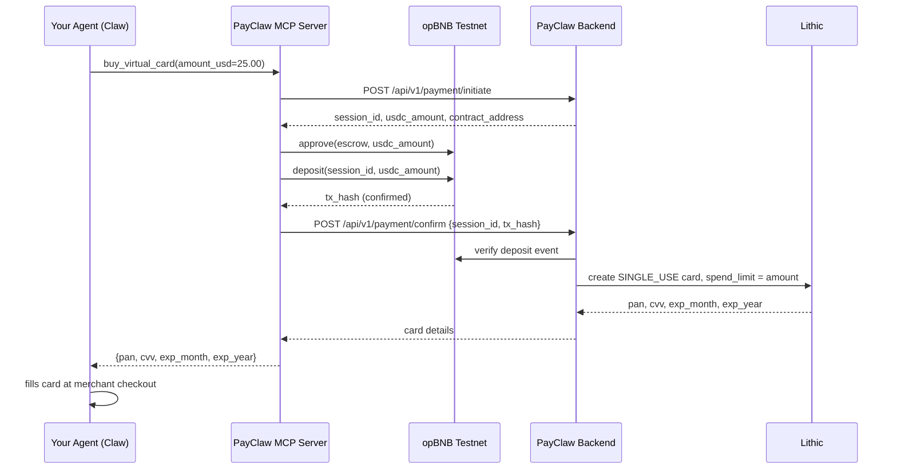

# PayClaw

The payment layer for your AI agent. Plug it in - Claw pays anywhere on the web, autonomously, without a card on file and without you touching anything.

## The Problem

Your agent can browse, decide, and act - but it can't pay. The only native option is [x402](https://x402.org/), which requires the merchant to explicitly support it. That's a tiny fraction of the internet.

Giving your agent a real debit card is worse: it has persistent access to your funds, and one bad checkout later your card number is compromised.

## What PayClaw Is

PayClaw is the abstraction layer between your agent and the web's payment infrastructure:

- Your agent calls `buy_virtual_card()` with an amount
- USDC is deposited into an on-chain escrow - nothing moves without your wallet signature
- A **single-use virtual card** is issued with an exact spend limit
- Your agent uses that card at any website checkout, just like a human would
- Card is dead after one charge. Unused balance refunded as USDC.

**No merchant opt-in. No card on file. No human in the loop.**

> x402 requires the website to support it. PayClaw works on every site that accepts Visa/Mastercard.

## Why It's Secure

- **On-demand, per-transaction cards** - a fresh card with an exact spend limit, every time. Your agent never holds a reusable number.
- **Spend-capped** - even if the card leaks, it can only be charged once for that exact amount, then it's dead.
- **You hold the crypto** - USDC stays in your wallet until you sign. PayClaw never custodies your funds.
- **No conversion** - you don't sell crypto for fiat. Escrow holds USDC, card issuance is triggered on-chain confirmation.

## How It Works

```
Your Agent (Claw / Claude / any MCP agent)
      │
      │  buy_virtual_card(amount_usd=25.00)
      ▼
PayClaw MCP Server
      │  signs + submits USDC escrow tx
      ▼
opBNB Testnet Escrow Contract
      │  on-chain confirmation
      ▼
PayClaw Backend
      │  verifies tx, issues card
      ▼
Lithic Single-Use Virtual Card
  (exact spend limit, one-time use, dead after charge)
      │
      ▼
Agent checks out on any website - no human needed
```

## Architecture

```
┌──────────────────────────────────────┐
│     Your Agent (Claw, Claude, etc.)  │
│   "buy X from website Y for $25"     │
└───────────────┬──────────────────────┘
                │ MCP: buy_virtual_card()
                ▼
┌──────────────────────────────────────┐
│         PayClaw MCP Server           │
│  Signs & submits USDC escrow tx      │
└───────────────┬──────────────────────┘
                │ POST /api/v1/payment/confirm
                ▼
┌──────────────────────────────────────┐
│         PayClaw Backend (FastAPI)    │
│  Verifies on-chain deposit           │
│  Issues Lithic single-use card       │
└───────────────┬──────────────────────┘
                │ {pan, cvv, expiry}
                ▼
┌──────────────────────────────────────┐
│   Agent fills card at any checkout   │
│   Works on any website, no opt-in    │
└──────────────────────────────────────┘
```

## vs. x402

| | x402 | PayClaw |
|---|---|---|
| Merchant opt-in required | Yes | No |
| Card exposure risk | N/A | None - single-use, spend-capped |
| Crypto stays as crypto | Yes | Yes - USDC, no conversion |
| Agent autonomy | Full | Full |
| Coverage | ~handful of sites | Every site that accepts cards |

## Tech Stack

| Layer | Technology |
|---|---|
| Blockchain | opBNB Testnet · USDC (ERC-20) |
| Smart contract | Solidity escrow (`PayClawEscrow.sol`) |
| Card issuance | Lithic virtual cards (SINGLE_USE) |
| Backend | Python / FastAPI |
| Agent interface | MCP (FastMCP) |
| Dashboard | React + Vite |

## Plug Into Your Agent

The MCP server gives your agent two tools:

- **`buy_virtual_card(amount_usd, merchant_name?)`** - deposits USDC, returns a single-use card
- **`check_wallet_balance()`** - returns the agent wallet's USDC balance

Add to your Claude Desktop config (`~/.claude/claude_desktop_config.json`):

```json
{
  "mcpServers": {
    "payclaw": {
      "command": "python",
      "args": ["/path/to/payclaw/mcp/server.py"],
      "env": {
        "AGENT_PRIVATE_KEY": "0x...",
        "PAYCLAW_API_URL": "https://payclaw-production-bad6.up.railway.app",
        "PAYCLAW_API_KEY": "sk_payclaw_..."
      }
    }
  }
}
```

Your agent now handles payments autonomously:

```
"Buy me a Cadbury Dairy Milk from ChocoBazaar"

# Claw calls PayClaw - no human steps:
#  ◆  deposits USDC into escrow on-chain
#  ◆  receives a single-use virtual card
#  ◆  checks out on the merchant site
#  ✓  card is dead after one charge
```

## Payment Flow (Technical)



## Running Locally

### Backend

```bash
cd backend
python3 -m venv venv
source venv/bin/activate
pip install -r requirements.txt
python3 -m uvicorn src.main:app --reload --port 8000
```

Set in `backend/.env`:

```
LITHIC_API_KEY=...
USDC_CONTRACT_ADDRESS=0x...
ESCROW_CONTRACT_ADDRESS=0x...
PAYCLAW_API_KEY=sk_payclaw_...
```

### MCP Server

```bash
cd mcp
pip install -r requirements.txt
cp .env.example .env   # fill AGENT_PRIVATE_KEY + PAYCLAW_API_KEY
python server.py
```

### Dashboard

```bash
cd dashboard && npm install && npm run dev
```

Runs at `http://localhost:3001` - manual MetaMask flow for testing without an agent.

## Project Structure

```
backend/      FastAPI server - payment sessions, card issuance
contracts/    Solidity escrow (PayClawEscrow.sol) on opBNB Testnet
dashboard/    React UI - manual payment + card display
mcp/          MCP server - agent payment tools
```

## Deployed

**Backend API**: [https://payclaw-production-bad6.up.railway.app](https://payclaw-production-bad6.up.railway.app)

## Notes

- opBNB Testnet - get free tBNB from the [opBNB faucet](https://www.bnbchain.org/en/testnet-faucet)
- Lithic sandbox - no real money involved
- Cards are SINGLE_USE and closed after first charge
- 5% buffer on every card spend limit to cover taxes/fees; unused amount refunded as USDC
